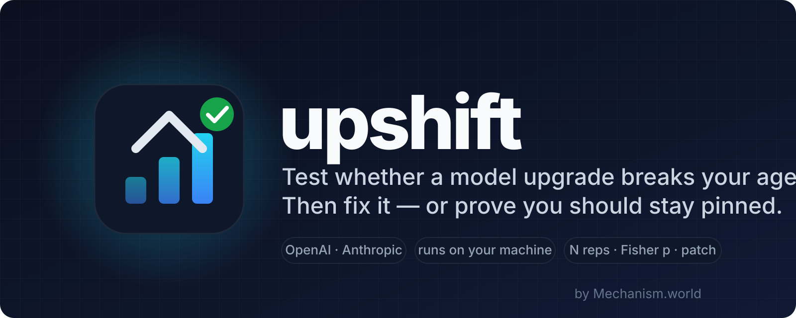

<p align="center">
  <a href="https://mechanism.world"></a>
</p>

<p align="center">
  <a href="https://github.com/Mechanism-world/upshift/actions/workflows/ci.yml"></a>
  <a href="https://github.com/Mechanism-world/upshift/releases"></a>
  <a href="LICENSE"></a>
  
  
  
</p>

**upshift** takes a tool-calling agent, runs its eval cases on two model versions, tells you
with a p-value what regressed, tries a small set of repairs, and either hands you a patch
it has verified against your whole suite — or tells you to stay pinned, and why. It runs
entirely on your machine with your own API keys. Every claim in this README is backed by
run records committed in this repository.

- **Two providers**: OpenAI (chat/completions, responses) and Anthropic (messages).
- **Statistics, not vibes**: N runs per case (default 5), pass/fail as rates, Fisher exact
  p on every label, contested results re-tested on 2N. Deterministic checks only — no LLM
  judge.
- **Repairs that earn their place**: prompt edits, model params (effort included), tool
  schemas, endpoint routing. A repair is accepted only if it restores a broken case, breaks
  nothing, and survives a full-suite re-verification.
- **Three verdicts**: `SAFE`, `SAFE WITH PATCH`, `STAY PINNED`. The patch is `git apply`-able.
- **`upshift adapt`** reads your agent's codebase (Python, notebooks) and writes the adapter
  with a `file:line` citation for everything — anything it can't trace to source is omitted
  and reported, never invented.

## Install

Python 3.12+ and an environment with [uv](https://docs.astral.sh/uv/) or pipx:

```bash
uv tool install git+https://github.com/Mechanism-world/upshift
```

```bash
pipx install git+https://github.com/Mechanism-world/upshift
```

Verify: `upshift --version`. Nothing is installed globally beyond the `upshift` command; no
daemon, no account, no telemetry.

## Quick start

Sixty seconds, no API key. The built-in deterministic simulator runs the whole pipeline:

```bash
upshift init my-agent
upshift upgrade --agent my-agent --provider sim \
  --baseline-model sim-5.5 --candidate-model sim-5.6-sol --tag demo
```

You'll watch a baseline run, a candidate run that regresses 36/38 cases, a repair loop that
restores all of them, a `SAFE WITH PATCH` verdict, and a patch — in about a second, for $0.
(Simulator results validate the machinery, never a real model: every report is tagged with
its provider, and sim evidence can never produce a real verdict.)

The Anthropic-shaped simulator (`sim-fable-5` → `sim-fable-5-1`) reproduces the documented
Claude Fable 5.1 breaks the same way, for $0.

### A real upgrade

Point upshift at your own agent — generated by `adapt` or written by hand ([ADAPTER.md](ADAPTER.md)) —
put the key in your environment or a local `.env`, and run:

```bash
# OpenAI
upshift upgrade --agent my-agent --flex \
  --baseline-model gpt-5.5 --candidate-model gpt-5.6-sol --tag my-upgrade

# Anthropic
upshift upgrade --agent my-agent --provider anthropic \
  --baseline-model claude-fable-5 --candidate-model claude-fable-5-1 --tag my-upgrade
```

`--flex` uses OpenAI's flex tier (~50% cheaper, stacks with prompt caching); the Anthropic
path caches the prompt prefix automatically. `upshift cost` prints the exact recorded spend.
Runs are resumable — Ctrl-C exits immediately and a rerun picks up where it stopped.

### Onboarding your agent in minutes

```bash
upshift adapt https://github.com/you/your-agent --out my-agent --flex
```

`adapt` statically ranks the repo, uses the model as an extraction engine over cited
evidence, verifies every *verbatim* claim against the cited file mechanically, and writes
the five adapter files plus an `ADAPT_REPORT.md`: what it found, what it inferred, what it
could not determine, and exactly which lines to review. Measured on real repos — from
zero-edit on a simple agent to an honest refusal on schemas buried across files:
[the adapt reports](reports/).

### Framework agents (capture mode)

If the failing request is built inside pydantic-ai, litellm, LangChain, the Vercel AI SDK,
the Claude Agent SDK or opencode, there is nothing to lift into five adapter files. So don't
read the framework — record it. `upshift capture` stands between your agent and
`api.anthropic.com` and writes down the bytes it actually sends:

```bash
upshift capture --out cap                      # terminal 1: a local recorder on 127.0.0.1:8787
ANTHROPIC_BASE_URL=http://127.0.0.1:8787 ./run-my-agent    # terminal 2: your agent, unchanged
                                               # Ctrl-C the recorder when you're done
upshift adapt --from-capture cap --out my-agent
upshift upgrade --agent my-agent --provider anthropic \
  --baseline-model claude-fable-5 --candidate-model claude-fable-5-1 --tag my-upgrade
```

`adapt --from-capture` calls no model and reads no source: the prompt, the tools, the params
and the cases all come out of requests your agent really made. The recorder is loopback-only
by default, never writes a credential or an account identifier to disk, relays a 400 verbatim,
and reassembles SSE so a streaming agent adapts like a non-streaming one.

**Where to point each framework.** Every row was read from that framework's own source; the
citations and versions are in [docs/framework-mapping.md](docs/framework-mapping.md).

| framework | set this |
|---|---|
| `anthropic` Python / TypeScript SDK | `ANTHROPIC_BASE_URL=http://127.0.0.1:8787` |
| pydantic-ai | `ANTHROPIC_BASE_URL=http://127.0.0.1:8787` |
| litellm | `ANTHROPIC_API_BASE` or `ANTHROPIC_BASE_URL` — the **origin only**; litellm appends `/v1/messages` itself |
| langchain-anthropic | `ANTHROPIC_API_URL` (else `ANTHROPIC_BASE_URL`); it sends no header of its own, so add `--framework langchain-anthropic` |
| Vercel AI SDK | `ANTHROPIC_BASE_URL=http://127.0.0.1:8787/v1` — **with the `/v1`**: it requests `baseURL + "/messages"` |
| claude-agent-sdk | `ANTHROPIC_BASE_URL` in the process env, or `ClaudeAgentOptions(env=…)` |
| opencode | `provider.anthropic.options.baseURL` in `opencode.json` — **no env var exists**; same `/v1` rule as the AI SDK |

When a repair is accepted, the report and the patch say where that repair lives in *your*
framework — `AnthropicModelSettings(anthropic_effort=…)`, `drop_params=True`,
`providerOptions.anthropic.effort` — with the file and line each mapping was verified at. A
knob a framework does not have is reported as "not mapped", never guessed.

Live smoke on a real pydantic-ai agent, `claude-fable-5` → `claude-fable-5-1`:
[reports/capture-pydantic-ai-smoke.md](reports/capture-pydantic-ai-smoke.md).

## What it has found so far

Every number below is reproducible from the committed records with `upshift cost` and
`upshift diff`.

**OpenAI, gpt-5.5 → gpt-5.6-sol.** Our 38-case booking agent regressed 36/38 (the
documented function-tools 400 on chat/completions, then behavioral regressions once that
was routed around). Three stacked, full-suite-verified repairs restored 32/36 with zero
confirmed collateral — and the verdict was still `STAY PINNED`, because the bar is *every*
regression repaired. [Full accounting.](runs/real-56sol/REPORT.md) Then
[shell_gpt](https://github.com/TheR1D/shell_gpt) (12k stars): 14/14 regressed on the same
400 with no workaround in its config; one one-line endpoint repair restored 14/14 —
`SAFE WITH PATCH`, $0.56. [Report](reports/shellgpt-upgrade.md) ·
[upstream issue](https://github.com/TheR1D/shell_gpt/issues/801).

**Anthropic, Claude Fable 5 → Fable 5.1, run on release day.** The cookbook SMS bot that
forces `tool_choice: any` broke 5/5 cases on the documented 400 and was fully restored —
drop the forced choice, add the documented instruction, one rung of effort —
`SAFE WITH PATCH`, 0 broken, $0.93. A quickstarts agent built around parallel tool calls
showed no regression at N=5. A third agent turned out to be broken *before* the
migration. [Report](reports/fable-5-1-upgrade.md) · upstream issues
[FACT#5](https://github.com/ruvnet/FACT/issues/5),
[claude-cookbooks#854](https://github.com/anthropics/claude-cookbooks/issues/854).

## How it fits together

- **The adapter** (`agent.json`, system prompt, tool schemas, `backend.py`, `cases/`) — five
  files that describe your agent to upshift. The repair loop may edit only the first three;
  your backend and your cases are the yardstick and are never touched.
- **The runner** executes every case N times per model and records everything: the manifest,
  each API request and response verbatim, each tool execution, each check — under
  `runs/<run_id>/`. Runs resume from disk.
- **The differ** labels each case (stable-pass, stable-fail, regressed, improved, flaky) with a
  Fisher exact p, and classifies failures into signatures that drive repair.
- **The repair loop** screens a candidate on the broken cases, verifies it on the full suite,
  adjudicates contested statuses on 2N reps, and stacks accepted repairs. Rejected on
  confirmed evidence means never retried.
- **The verdict** and the patch. `SAFE WITH PATCH` requires every regression restored and
  nothing broken; anything less is `STAY PINNED` with the evidence attached.
- **`adapt`** and the **simulators** get you to a first run without hand-writing the adapter
  or spending money.

Design decisions, in one file: [DESIGN.md](DESIGN.md). The adapter contract: [ADAPTER.md](ADAPTER.md).

## Why single runs lie

Agents are stochastic. A borderline case passing 4/5, 3/5, 3/5, 4/5 across four runs — with
or without a patch — is what we measured on our first real run, and a single-sample rule
would have vetoed every behavioral repair we had. upshift never decides on one run: outcomes
are rates against fixed thresholds (≥ 0.8 pass, ≤ 0.4 fail, otherwise flaky), contested
statuses get 2N reps at unchanged thresholds, symmetric for restorations and vetoes, and the
playbook contains no repair that dictates exact output phrasings — restoring an eval by
overfitting to its assertions would make the number a lie.

Anthropic's official migration skill (`/claude-api migrate`) edits your code for a target
model and "produces a checklist of items to verify manually." upshift is that verification:
it runs your suite on both versions, proves each repair against it, and hands you the patch
with the evidence — or tells you to stay pinned.

## Security and privacy

- **Nothing leaves your machine.** Your keys are read from your environment or a local `.env`
  and used only to call the provider you chose. Prompts, transcripts, and results are written
  to your local `runs/` directory. No telemetry, no account, no server.
- **Run records contain your prompts and the models' outputs verbatim** — that is what makes
  them evidence. Review them before publishing yours.
- **Backends you run are executed.** The `backend.py` in an adapter is code; the shell_gpt
  adapter runs model-generated commands inside Docker with `--network none`.
- **`adapt` reads; it does not execute.** It reads a repository's files and sends cited slices
  to the model you configured.
- Vulnerability reports: see [SECURITY.md](SECURITY.md).

## Documentation

| Goal | Start here |
|---|---|
| Describe your agent to upshift | [ADAPTER.md](ADAPTER.md) |
| Understand every design decision and the statistics | [DESIGN.md](DESIGN.md) |
| Read the migration evidence | [shell_gpt on gpt-5.6](reports/shellgpt-upgrade.md) · [four Claude agents on Fable 5.1](reports/fable-5-1-upgrade.md) |
| See what `adapt` does on real repos | [adapt reports](reports/) |
| Capture a framework agent at the wire | [docs/framework-mapping.md](docs/framework-mapping.md) |
| What's out of scope, and why | [ROADMAP.md](ROADMAP.md) · [SCOPE.md](SCOPE.md) |
| What changed | [CHANGELOG.md](CHANGELOG.md) |

## Honest limits

- Tested on our synthetic agent and a handful of open-source agents (one on OpenAI, four on
  Anthropic). That is evidence, not a benchmark suite.
- Two providers. Plain API agents on both; framework agents on Anthropic only, through
  `upshift capture` — no Google, no local models, and still no code-level framework
  integration ([ROADMAP.md](ROADMAP.md)).
- Repairs are limited to prompts, params, tool schemas, and endpoint routing. Anthropic's
  thinking-block invalidation is detected and refused with the documented pointer, not
  repaired. The tool-schema repair covers one known tool shape.
- Tools that touch the world (shell, network, clusters) need a human-written deterministic
  backend; `adapt` stubs them with a TODO. Its generated eval cases are drafts.
- `adapt` doesn't yet chase identifiers across files, and reads notebooks as rendered cell
  text (cite lines accordingly).
- Capture mode has been exercised live against one framework (pydantic-ai, 3 cases at N=3 —
  a smoke, not evidence). The other seven mapping rows are verified from source, not from a
  live capture. A capture is a record of what your agent did, so the suite it produces is
  only as broad as the session you recorded.
- N=5 with Fisher exact tests tells you a 5/5 → 0/5 collapse is real (p ≈ 0.004). It will not
  resolve subtle single-case effects, and a clean result on one agent is not proof that a
  documented shift doesn't exist. Raise N if you need more power and can pay for it.

## Development

```bash
git clone https://github.com/Mechanism-world/upshift && cd upshift
uv sync --group dev
uv run ruff check src tests && uv run pytest -q
```

macOS note: uv's editable-install `.pth` file sometimes gets the `UF_HIDDEN` flag and CPython
skips it; tests self-heal via `tests/conftest.py`, and for the CLI entry point run
`chflags nohidden .venv/lib/python3.12/site-packages/*.pth`. See [CONTRIBUTING.md](CONTRIBUTING.md).

## Community

- **The ask:** if you run a tool-calling agent, point `upshift adapt` at it and tell us what it
  got wrong — [open an agent report](https://github.com/Mechanism-world/upshift/issues/new/choose).
  Nothing leaves your machine.
- Questions and ideas: [Discussions](https://github.com/Mechanism-world/upshift/discussions).
- Bugs: [Issues](https://github.com/Mechanism-world/upshift/issues).
- Project site: [mechanism.world](https://mechanism.world).

upshift is built by [Mechanism.world](https://github.com/Mechanism-world) and released under
the MIT License.

## Contributors

<a href="https://github.com/Mechanism-world/upshift/graphs/contributors">
  
</a>

## License

[MIT](LICENSE). This repository includes material derived from third-party projects under
their own licenses and quotes provider documentation for interoperability — see
[THIRD_PARTY_NOTICES.md](THIRD_PARTY_NOTICES.md). OpenAI, GPT, Anthropic, and Claude are
trademarks of their respective owners; upshift is not affiliated with or endorsed by either.
